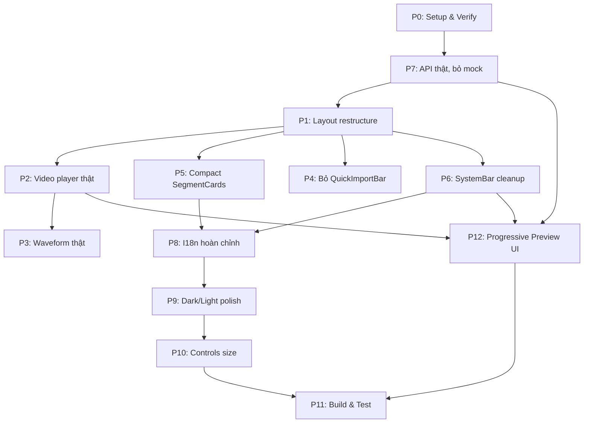

# VI-DUBBER UI Fix Plan — Toàn Bộ

> **Target**: Worker (Gemini 3.8 Flash / Antigravity) sửa toàn bộ UI frontend React
> **Repo**: `d:\ANNAM\TradingWorkspace\projects\vi-dubber\frontend\`
> **Stack**: React 18.3 + TypeScript 5.7 + Vite 6.1 + Tailwind CSS 3.4 + Lucide React
> **Backend**: FastAPI trên port `7860` — API đã sẵn sàng, endpoints hoạt động

---

## Mục lục

1. [Tổng quan vấn đề](#1-tổng-quan-vấn-đề)
2. [Phase 0: Khởi động & Xác nhận môi trường](#phase-0)
3. [Phase 1: Restructure Layout — Bỏ ProTelemetryGrid khỏi main](#phase-1)
4. [Phase 2: Video Player thật — \<video\> element](#phase-2)
5. [Phase 3: Audio / Waveform thật — Web Audio API](#phase-3)
6. [Phase 4: Loại bỏ trùng lặp Import (QuickImportBar + JobCreatorModal)](#phase-4)
7. [Phase 5: Compact SegmentCards + UX cải thiện](#phase-5)
8. [Phase 6: SystemBar cleanup — Bớt rối, rõ ràng hơn](#phase-6)
9. [Phase 7: Kết nối API thật — Bỏ mock fallback khi backend sẵn sàng](#phase-7)
10. [Phase 8: I18n hoàn chỉnh + Nhất quán ngôn ngữ](#phase-8)
11. [Phase 9: Dark mode & Light mode polish](#phase-9)
12. [Phase 10: Controls size + Interaction improvements](#phase-10)
13. [Phase 11: Build, Test & Verify](#phase-11)
14. [Phase 12: Progressive Preview & Chunk Monitor (P23)](#phase-12)
15. [File Map & Dependency Graph](#file-map)
16. [Quy tắc bắt buộc](#rules)

---

## 1. Tổng quan vấn đề

UI hiện tại đẹp về mặt visual nhưng có **12 nhóm lỗi / capability gap** cần sửa:

| # | Vấn đề | Mức độ |
|---|--------|--------|
| 1 | Video player giả (mock), không chơi video thật | 🔴 Critical |
| 2 | Waveform player giả (sinh random bars), không load audio thật | 🔴 Critical |
| 3 | Segment cards quá to, chiếm nhiều không gian, khó scan nhanh | 🟡 Major |
| 4 | QuickImportBar + JobCreatorModal trùng lặp chức năng | 🟡 Major |
| 5 | SystemBar (pipeline stepper) quá phức tạp, rối mắt trên 36px | 🟡 Major |
| 6 | Dark mode có lỗi contrast, khó đọc ở nhiều chỗ | 🟡 Major |
| 7 | Light mode thiếu polish | 🟠 Medium |
| 8 | Text hardcode VN xen EN không nhất quán | 🟠 Medium |
| 9 | Nút bấm / controls quá nhỏ trên một số khu vực | 🟠 Medium |
| 10 | Mock data hiện quá nhiều, gây confused | 🔴 Critical |
| 11 | I18n chưa hoàn chỉnh, nhiều string chưa dịch | 🟠 Medium |
| 12 | Job dài phải chờ full output mới xem/tải, chưa có chunk preview | 🔴 Critical cho long-form |

**Quyết định kiến trúc layout** (đã quyết):
- **Giữ 2-column** nhưng đổi tỷ lệ: Left 4 cols (video + waveform), Right 8 cols (segment review)
- **ProTelemetryGrid**: Ẩn mặc định, chuyển thành bottom drawer (kéo lên từ dưới khi bấm "Engineer" toggle)
- Segment reviewer được không gian lớn hơn vì đây là workflow chính

---

<a id="phase-0"></a>
## Phase 0: Khởi động & Xác nhận môi trường

### Tasks:

**P0.1** — Đọc kỹ các file sau trước khi code:
- [ ] `d:\ANNAM\TradingWorkspace\projects\vi-dubber\README.md`
- [ ] `d:\ANNAM\TradingWorkspace\projects\vi-dubber\frontend\package.json`
- [ ] `d:\ANNAM\TradingWorkspace\projects\vi-dubber\frontend\vite.config.ts`
- [ ] `d:\ANNAM\TradingWorkspace\projects\vi-dubber\frontend\tailwind.config.js`
- [ ] `d:\ANNAM\TradingWorkspace\projects\vi-dubber\frontend\src\App.tsx`
- [ ] `d:\ANNAM\TradingWorkspace\projects\vi-dubber\frontend\src\types\index.ts`
- [ ] `d:\ANNAM\TradingWorkspace\projects\vi-dubber\frontend\src\context\JobContext.tsx`
- [ ] `d:\ANNAM\TradingWorkspace\projects\vi-dubber\frontend\src\lib\api.ts`
- [ ] `d:\ANNAM\TradingWorkspace\projects\vi-dubber\frontend\src\lib\mockData.ts`
- [ ] `d:\ANNAM\TradingWorkspace\projects\vi-dubber\frontend\src\lib\utils.ts`

**P0.2** — Chạy dev server xác nhận trạng thái hiện tại:
```powershell
cd d:\ANNAM\TradingWorkspace\projects\vi-dubber\frontend
npm install
npm run dev
```
Xác nhận Vite dev server khởi động OK, không có compile errors.

**P0.3** — Xác nhận backend API hoạt động:
```powershell
curl http://127.0.0.1:7860/api/health
curl http://127.0.0.1:7860/api/system
curl http://127.0.0.1:7860/api/jobs
```

> [!IMPORTANT]
> Nếu backend không chạy, vẫn tiến hành sửa UI nhưng giữ graceful fallback (hiện "Backend offline" thay vì mock data giả).

---

<a id="phase-1"></a>
## Phase 1: Restructure Layout — ProTelemetryGrid thành Bottom Drawer

### Mục tiêu
- Chuyển ProTelemetryGrid từ cột trái xuống **bottom collapsible drawer** toàn-chiều-ngang
- Ẩn mặc định, chỉ mở khi user bấm toggle "🔧 Engineer" trên SystemBar
- Left column thu gọn lại (col-span-4): chỉ giữ Video + Waveform
- Right column mở rộng (col-span-8): Segment Reviewer được nhiều không gian hơn

### Files cần sửa

#### 1.1 `App.tsx` — Restructure grid layout
```
TRƯỚC:
  <main className="... grid grid-cols-12 ...">
    <section className="col-span-12 lg:col-span-5 ...">
      <QuickImportBar />     ← SẼ BỎ (Phase 4)
      <VideoPlayer />
      <WaveformPlayer />
      <ProTelemetryGrid />   ← SẼ CHUYỂN XUỐNG
    </section>
    <section className="col-span-12 lg:col-span-7 ...">
      <SegmentReviewer />
    </section>
  </main>

SAU:
  <main className="... grid grid-cols-12 ...">
    <section className="col-span-12 lg:col-span-4 ...">
      <VideoPlayer />
      <WaveformPlayer />
    </section>
    <section className="col-span-12 lg:col-span-8 ...">
      <SegmentReviewer />
    </section>
  </main>

  {/* Bottom Drawer - Engineer Telemetry */}
  <EngineerDrawer />       ← MỚI
```

#### 1.2 Tạo `components/telemetry/EngineerDrawer.tsx` (MỚI)
- Wrapper component: một drawer kéo từ dưới lên
- Chiều cao mặc định: collapsed (thanh 32px chỉ hiện label "🔧 ENGINEER TELEMETRY")
- Khi mở: chiều cao 35vh, chứa ProTelemetryGrid (tabs giữ nguyên)
- Trạng thái open/close lưu vào `localStorage` (key: `vi_dubber_engineer_drawer`)
- Animation: `transition-[height] duration-300 ease-in-out`

```tsx
// Skeleton:
export const EngineerDrawer: React.FC = () => {
  const [isOpen, setIsOpen] = useState(() =>
    localStorage.getItem('vi_dubber_engineer_drawer') === 'open'
  );

  return (
    <div className={`shrink-0 border-t border-slate-200 dark:border-slate-800
      transition-[height] duration-300 overflow-hidden
      ${isOpen ? 'h-[35vh]' : 'h-8'}`}>
      {/* Toggle bar */}
      <button onClick={toggle} className="h-8 w-full flex items-center ...">
        <Wrench /> Engineer Telemetry
        <ChevronUp className={isOpen ? '' : 'rotate-180'} />
      </button>
      {/* Content */}
      {isOpen && <ProTelemetryGrid />}
    </div>
  );
};
```

#### 1.3 Cập nhật `SystemBar.tsx`
- Thêm nút toggle "🔧 Engineer" nếu chưa có, hoặc kết nối với EngineerDrawer state

---

<a id="phase-2"></a>
## Phase 2: Video Player thật — \<video\> element

### Mục tiêu
- Thay thế mock canvas bằng **`<video>` element thật**
- Load video từ URL: `/work/job-{id}/output.mp4` (có sẵn trong backend)
- Khi chưa có video / job chưa complete: hiện placeholder đẹp (icon + text)
- Giữ nguyên controls: play/pause, prev/next segment, loop, speed, mute, fullscreen
- Subtitle overlay vẫn hoạt động (position absolute trên video)
- Drag-and-drop import vẫn hoạt động

### Files cần sửa

#### 2.1 `components/monitor/VideoPlayer.tsx` — Major rewrite

Thay đổi chính:
1. Thêm `<video>` element với `ref`:
```tsx
const videoRef = useRef<HTMLVideoElement>(null);

// Compute video source URL
const videoSrc = useMemo(() => {
  if (!activeJob) return null;
  if (activeJob.status !== 'completed') return null;
  const output = activeJob.result?.output;
  if (output) return `/work/${activeJob.id}/${output.split('/').pop()}`;
  return `/work/${activeJob.id}/output.mp4`;
}, [activeJob]);
```

2. Sync `currentTime` bidirectionally:
```tsx
// Video → State
const handleTimeUpdate = () => {
  if (videoRef.current) {
    setCurrentTime(videoRef.current.currentTime);
  }
};

// State → Video (khi user click segment card)
useEffect(() => {
  if (videoRef.current && Math.abs(videoRef.current.currentTime - currentTime) > 0.5) {
    videoRef.current.currentTime = currentTime;
  }
}, [currentTime]);
```

3. Sync play/pause:
```tsx
useEffect(() => {
  if (!videoRef.current) return;
  if (isPlaying) videoRef.current.play().catch(() => {});
  else videoRef.current.pause();
}, [isPlaying]);
```

4. Xóa bỏ hoàn toàn simulation ticker (setInterval 100ms)

5. Khi `videoSrc` là null: hiện placeholder

```tsx
{videoSrc ? (
  <video
    ref={videoRef}
    src={videoSrc}
    onTimeUpdate={handleTimeUpdate}
    onPlay={() => setIsPlaying(true)}
    onPause={() => setIsPlaying(false)}
    onEnded={() => { setIsPlaying(false); setCurrentTime(0); }}
    muted={isMuted}
    playsInline
    className="w-full h-full object-contain bg-black"
  />
) : (
  <VideoPlaceholder job={activeJob} />
)}
```

6. Video container aspect ratio: sử dụng `aspect-video` (16:9) thay cho fixed `h-[145px]`

7. **Giữ nguyên**: Drag-and-drop, subtitle overlay, scrub bar, media controls bar — chỉ sửa data source

#### 2.2 Scrub bar click-to-seek
Thêm click handler trên scrub bar:
```tsx
const handleScrubClick = (e: React.MouseEvent<HTMLDivElement>) => {
  const rect = e.currentTarget.getBoundingClientRect();
  const pct = (e.clientX - rect.left) / rect.width;
  const newTime = pct * totalDuration;
  setCurrentTime(newTime);
  if (videoRef.current) videoRef.current.currentTime = newTime;
};
```

#### 2.3 Backend check
Confirm backend serves static files from `/work/`:
```
GET /work/job-{id}/output.mp4 → Served via FastAPI static mount
```
File: `src/vi_dubber/api.py` line ~614 already serves `/{full_path:path}` which includes `/work/` assets.

> [!NOTE]
> Nếu video file chưa tồn tại (job chưa complete), `<video>` sẽ không load → hiện placeholder tự nhiên. Không cần thêm error handling phức tạp.

---

<a id="phase-3"></a>
## Phase 3: Audio / Waveform thật — Web Audio API

### Mục tiêu
- Load audio thật từ backend thay vì vẽ random bars
- Hỗ trợ 3 track: A (vocal EN), B (vocal VI dub), BGM (nhạc nền)
- Vẽ waveform thật bằng Web Audio API `decodeAudioData` → canvas

### Files cần sửa

#### 3.1 `components/monitor/WaveformPlayer.tsx` — Rewrite

**Audio sources** (từ backend `/work/` directory):
```
Track A (Original EN):  /work/job-{id}/vocals.wav
Track B (Vietnamese dub): /work/job-{id}/voice_track.wav  
Track BGM:               /work/job-{id}/accompaniment.wav
```

**Implementation**:
1. Thêm `<audio>` element ẩn cho playback:
```tsx
const audioRef = useRef<HTMLAudioElement>(null);

const audioSrc = useMemo(() => {
  if (!activeJob) return null;
  const base = `/work/${activeJob.id}`;
  if (selectedAudioTrack === 'a') return `${base}/vocals.wav`;
  if (selectedAudioTrack === 'b') return `${base}/voice_track.wav`;
  return `${base}/accompaniment.wav`;
}, [activeJob, selectedAudioTrack]);
```

2. Fetch audio buffer → extract peaks → draw:
```tsx
useEffect(() => {
  if (!audioSrc) return;
  const audioCtx = new AudioContext();
  fetch(audioSrc)
    .then(r => r.arrayBuffer())
    .then(buf => audioCtx.decodeAudioData(buf))
    .then(decoded => {
      const rawData = decoded.getChannelData(0);
      const peaks = extractPeaks(rawData, 128); // downsample to 128 bars
      drawWaveform(canvasRef.current, peaks, selectedAudioTrack);
    })
    .catch(() => drawFallbackWaveform(canvasRef.current)); // graceful fallback
}, [audioSrc]);
```

3. Nếu file audio không tồn tại: vẽ flat line + text "No audio available"

4. Sync playback với video: khi user chơi Track A/B thay cho video audio:
```tsx
// When playing a specific audio track, mute video and play audio element
useEffect(() => {
  if (audioRef.current && isPlaying) {
    audioRef.current.currentTime = currentTime;
    audioRef.current.play();
  }
}, [isPlaying, currentTime, selectedAudioTrack]);
```

> [!TIP]
> Nếu file audio lớn (>50MB), cân nhắc chỉ fetch một đoạn segment thay vì toàn bộ. Nhưng ban đầu cứ fetch cả file, optimize sau.

---

<a id="phase-4"></a>
## Phase 4: Loại bỏ trùng lặp Import

### Vấn đề
`QuickImportBar` và `JobCreatorModal` cả hai đều:
- Cho nhập YouTube URL
- Cho chọn file local
- Bấm "Dub ngay"

Trùng lặp hoàn toàn. User confused không biết dùng cái nào.

### Giải pháp: **Bỏ QuickImportBar**, giữ JobCreatorModal

#### 4.1 `App.tsx`
- Xóa `<QuickImportBar />` khỏi render
- Xóa import statement

#### 4.2 Header.tsx
- Nút "➕ Ingest" trên header đã trigger `setIsCreatorOpen(true)` → Đủ rồi
- Thêm visual prominence cho nút này (nó là entry point duy nhất bây giờ)

#### 4.3 VideoPlayer.tsx
- Giữ nguyên drag-and-drop trên video player → trigger `setIsCreatorOpen(true)` (đã có)
- Giữ nút "Import Video" overlay trên video → trigger `setIsCreatorOpen(true)` (đã có)

#### 4.4 Có thể xóa file
- `components/import/QuickImportBar.tsx` → DELETE hoặc giữ nhưng không import

> [!NOTE]
> Không xóa file hẳn, chỉ bỏ import và render. Để worker không phải lo rollback nếu cần.

---

<a id="phase-5"></a>
## Phase 5: Compact SegmentCards + UX cải thiện

### Mục tiêu
- Giảm 40% chiều cao mỗi card để hiển thị nhiều segment hơn trên màn hình
- Giữ nguyên chức năng: edit, accept, rerender, Ctrl+Enter

### Files cần sửa

#### 5.1 `components/review/SegmentCard.tsx` — Compact redesign

**Thay đổi cụ thể**:

1. **Header row compact**: Gộp ID + Timecode + Speaker + Status vào 1 dòng ngang, không wrap:
```
TRƯỚC: [#001] [Play ▶ 00:12.3 - 00:16.8 (4.50s)]   [Speaker ▼] [ACCEPTED] [OVERFLOW]
        ─── border ───
SAU:   #001 ▶ 00:12-00:16 (4.5s) • SPEAKER_00 ▼ [✓ accepted] [⚠ overflow]
        (1 dòng duy nhất, không border separator)
```

2. **Bilingual content**: Chuyển từ `grid-cols-2` thành **stacked layout** (EN trên, VI dưới):
```
TRƯỚC (side-by-side): 
  [SOURCE (EN)]  |  [TARGET (VI) editable]
  
SAU (stacked, compact):
  EN: "The key strategy for managing risk is..."     [muted, smaller text]
  VI: [editable textarea, 1-2 rows]                  [orange border khi active]
```

Lý do: side-by-side tốn chiều ngang, trên col-span-8 vẫn hẹp với content dài. Stacked cho phép textarea full-width, dễ đọc hơn.

3. **Footer actions compact**: Gộp buttons vào 1 row nhỏ hơn:
```
TRƯỚC: [Revert] [Lưu chỉnh sửa] [Render lại TTS] [Duyệt đoạn này (Ctrl+Enter)]
SAU:   [Save] [Re-TTS] [✓ Accept]  (chỉ hiện Revert khi dirty)
        icon-only khi viewport nhỏ, text khi đủ rộng
```

4. **Padding/margin**: Giảm từ `p-3.5` → `p-2.5`, gap `mb-2.5` → `mb-1.5`

5. **Active state**: Thay border-2 bằng subtle left-border accent:
```tsx
className={`rounded-lg border p-2.5 transition-all cursor-pointer ${
  isActive 
    ? 'border-l-4 border-l-orange-500 border-slate-200 dark:border-slate-800 bg-orange-500/5 dark:bg-orange-500/5' 
    : 'border border-slate-200 dark:border-slate-800 hover:bg-slate-50 dark:hover:bg-slate-900'
}`}
```

6. **Character expansion**: Di chuyển vào inline sau textarea thay vì header riêng

#### 5.2 `components/review/SegmentReviewer.tsx` — Minor cleanup
- Header area: giảm padding
- Bỏ text "TỰ ĐỘNG 100% (QC TÙY CHỌN)" — confusing, không cần thiết
- Virtualized list: **Không bắt buộc phase này** nhưng nếu segment > 100, nên dùng `react-window` hoặc `@tanstack/react-virtual`

#### 5.3 `components/review/SegmentFilterBar.tsx`
- Giảm size filter pills
- Thêm count badges trực tiếp trên mỗi pill

---

<a id="phase-6"></a>
## Phase 6: SystemBar cleanup

### Vấn đề
SystemBar 36px nhồi quá nhiều thứ:
- GPU VRAM gauge
- RTF speed  
- WebGPT model/port
- ETA timer
- 7-stage pipeline stepper (7 nút)
- WS LIVE indicator
- Pause/Resume/Abort controls

Quá rối, không scan nổi.

### Giải pháp: Chia thành 2 logical groups, ẩn chi tiết ít quan trọng

#### 6.1 `components/header/SystemBar.tsx` — Simplify

**Giữ hiển thị chính** (luôn visible):
- Progress bar tổng (1 thanh ngang mỏng, full width, thay cho 7 nút stepper riêng)
- Trạng thái hiện tại: video thường `Stage 4/7: Translation — 62%`; P23 long-form: `Chunk 8/20 · Translation — 63%`
- ETA: `ETA 01:14`; P23 dùng rolling ETA theo throughput thật
- Controls: Pause / Resume / Abort

**Ẩn / Thu gọn** (hover hoặc click expand):
- GPU VRAM % → chỉ hiện khi hover progress bar  
- RTF speed → gộp vào ETA area
- WebGPT model → di chuyển vào Engineer Drawer (Phase 1)
- 7 nút stage riêng lẻ → thay bằng 1 progress bar có 7 marker dots

**Mới**: Unified progress bar:
```tsx
// 1 thanh progress chiếm phần lớn chiều ngang
<div className="flex-1 h-1.5 bg-slate-200 dark:bg-slate-800 rounded-full relative">
  {/* 7 stage marker dots */}
  {PIPELINE_STAGES.map((_, i) => (
    <div key={i} 
      className="absolute top-1/2 -translate-y-1/2 w-1.5 h-1.5 rounded-full ..."
      style={{ left: `${(i / 6) * 100}%` }} />
  ))}
  {/* Progress fill */}
  <div className="h-full bg-orange-500 rounded-full transition-all" 
    style={{ width: `${progress * 100}%` }} />
</div>

// Compact text bên phải:
<span>Stage {activeIndex+1}/7: {currentStageName} · {Math.round(progress*100)}% · ETA {eta}</span>
```

---

<a id="phase-7"></a>
## Phase 7: Kết nối API thật — Bỏ mock

### Mục tiêu
- Khi backend chạy: dùng data thật 100%
- Khi backend offline: hiện trạng thái "Offline" rõ ràng thay vì hiện mock data giả

### Files cần sửa

#### 7.1 `lib/api.ts` — Sửa fallback behavior

**TRƯỚC** (mọi API call catch → return mock):
```ts
} catch {
  return MOCK_JOBS;  // ← User thấy data giả, tưởng thật
}
```

**SAU** (throw error, let caller handle):
```ts
export async function fetchJobs(): Promise<JobState[]> {
  const res = await fetch(`${BASE_URL}/api/jobs`, { signal: AbortSignal.timeout(3000) });
  if (!res.ok) throw new Error(`HTTP ${res.status}`);
  const data = await res.json();
  return Array.isArray(data) ? data : data.jobs || [];
}
```

#### 7.2 `context/JobContext.tsx` — Handle offline state

```tsx
const [isBackendOnline, setIsBackendOnline] = useState<boolean | null>(null); // null = checking

const refreshJobs = useCallback(async () => {
  try {
    const [jobsData, sysData] = await Promise.all([
      fetchJobs(),
      fetchSystemStatus(),
    ]);
    setJobs(jobsData);
    setSystemStatus(sysData);
    setIsBackendOnline(true);
  } catch (err) {
    console.warn('Backend offline:', err);
    setIsBackendOnline(false);
    // KHÔNG set mock data — giữ empty state
  }
}, []);
```

Expose `isBackendOnline` vào context → components hiện banner:
```tsx
{isBackendOnline === false && (
  <div className="bg-amber-500/10 border-b border-amber-500/30 text-amber-600 text-xs text-center py-1 font-mono">
    ⚠ Backend offline — Khởi động server: cd projects/vi-dubber && uv run vi-dubber web
  </div>
)}
```

#### 7.3 `lib/mockData.ts`
- **KHÔNG XÓA** file — giữ để dùng cho development/demo mode
- Thêm flag: chỉ dùng mock khi `VITE_DEMO_MODE=true` trong env

```ts
export const USE_MOCK = import.meta.env.VITE_DEMO_MODE === 'true';
```

#### 7.4 Segment loading — real data
`fetchJobSegments()` hiện đã map fields đúng (`text`, `vi`, `speaker`, `review_status`). Giữ nguyên mapping logic nhưng bỏ mock fallback.

---

<a id="phase-8"></a>
## Phase 8: I18n hoàn chỉnh + Nhất quán ngôn ngữ

### Vấn đề
Nhiều string hardcode VN lẫn EN:
- Button labels: "Lưu chỉnh sửa", "Duyệt tất cả", "Render lại TTS" — hardcode VN
- Tooltips: "Bấm để chọn file video từ máy" — hardcode VN  
- Badge text: "TỰ ĐỘNG 100% (QC TÙY CHỌN)" — hardcode VN
- Tab labels: "[CUDA VRAM]", "[Latency]" — hardcode EN
- SystemBar: "ENGINEER // LIVE" — hardcode EN

### Giải pháp

#### 8.1 `context/I18nContext.tsx`
Audit toàn bộ dictionary, bổ sung missing keys. Cụ thể:

**Missing keys cần thêm** (tổng hợp từ tất cả components):
```ts
// SegmentCard
'review.save': { en: 'Save', vi: 'Lưu' },
'review.save_edit': { en: 'Save Edit', vi: 'Lưu chỉnh sửa' },
'review.saving': { en: 'Saving...', vi: 'Đang lưu...' },
'review.rerender_tts': { en: 'Re-render TTS', vi: 'Render lại TTS' },
'review.accept_segment': { en: 'Accept (Ctrl+Enter)', vi: 'Duyệt (Ctrl+Enter)' },
'review.accept_all': { en: 'Accept All', vi: 'Duyệt tất cả' },
'review.accepting': { en: 'Accepting...', vi: 'Đang duyệt...' },
'review.vi_placeholder': { en: 'Enter dubbed content...', vi: 'Nhập nội dung lồng tiếng...' },
'review.no_results': { en: 'No segments match current filter.', vi: 'Không tìm thấy đoạn nào.' },
'review.auto_qc': { en: '100% Automated (QC Optional)', vi: 'Tự động 100% (QC tùy chọn)' },
'review.approved': { en: 'Approved', vi: 'Đã duyệt' },
'review.target_duration': { en: 'Target Duration', vi: 'Thời lượng mục tiêu' },
'review.char_expansion': { en: 'chars', vi: 'ký tự' },

// SystemBar
'system.stage_of': { en: 'Stage {current}/{total}', vi: 'Bước {current}/{total}' },
'system.engineer_mode': { en: 'Engineer', vi: 'Kỹ thuật' },
'system.ws_live': { en: 'WS LIVE', vi: 'WS LIVE' },
'system.polling': { en: 'POLLING', vi: 'POLLING' },

// Telemetry  
'telemetry.engineer_telemetry': { en: 'Engineer Telemetry', vi: 'Bảng kỹ thuật' },

// Offline
'system.backend_offline': { en: '⚠ Backend offline', vi: '⚠ Backend offline' },
'system.start_hint': { en: 'Start server: ...', vi: 'Khởi động server: ...' },

// Hotkeys
'hotkeys.title': { en: 'Studio Hotkeys', vi: 'Phím tắt Studio' },
'hotkeys.play_pause': { en: 'Play / Pause', vi: 'Phát / Tạm dừng' },
'hotkeys.save_accept_next': { en: 'Save, Accept & Next', vi: 'Lưu, Duyệt & Tiếp' },
'hotkeys.save_edit': { en: 'Save edit', vi: 'Lưu chỉnh sửa' },
'hotkeys.next_segment': { en: 'Next segment', vi: 'Đoạn sau' },
'hotkeys.prev_segment': { en: 'Previous segment', vi: 'Đoạn trước' },
```

#### 8.2 Tất cả components — Replace hardcoded strings
Mỗi component: tìm mọi string literal tiếng Việt hoặc tiếng Anh → thay bằng `t('key')`.

**Checklist tệp cần audit string**:
- [ ] `SegmentCard.tsx` — nhiều hardcode nhất
- [ ] `SegmentReviewer.tsx`
- [ ] `SystemBar.tsx`
- [ ] `VideoPlayer.tsx`
- [ ] `WaveformPlayer.tsx`
- [ ] `ProTelemetryGrid.tsx`
- [ ] `JobCreatorModal.tsx`
- [ ] `DeepSettingsAccordion.tsx`
- [ ] `Header.tsx`

---

<a id="phase-9"></a>
## Phase 9: Dark mode & Light mode polish

### Dark mode fixes

#### 9.1 Contrast issues
Scan toàn bộ components cho các pattern contrast kém:

| Vấn đề | File | Fix |
|---------|------|-----|
| `text-slate-600 dark:text-slate-400` trên `dark:bg-slate-950` | Nhiều file | → `dark:text-slate-300` |
| `border-slate-200 dark:border-slate-800` quá mờ | Nhiều file | → `dark:border-slate-700` |
| `bg-slate-100 dark:bg-slate-800/80` — opacity 80% too dim | Nhiều file | → `dark:bg-slate-800` (full) |
| Text `text-[10px]` quá nhỏ + low contrast | SystemBar, badges | → `text-[11px]` min, contrast bump |
| `text-slate-500 dark:text-slate-400` secondary text | Nhiều | Ensure ratio ≥ 4.5:1 on `bg-slate-950` |

#### 9.2 Quy tắc chung
- Background: `dark:bg-[#090d16]` (root), `dark:bg-slate-900` (panels), `dark:bg-slate-950` (inputs/recessed)
- Text primary: `dark:text-slate-100`
- Text secondary: `dark:text-slate-300` (KHÔNG `dark:text-slate-400` cho text cần đọc)
- Text tertiary/disabled: `dark:text-slate-500`
- Borders: `dark:border-slate-700` (visible) hoặc `dark:border-slate-800` (subtle)

### Light mode fixes

#### 9.3 Polish items
- Thêm subtle shadow cho cards: `shadow-sm` (đã có nhưng kiểm tra consistency)
- Input focus states: thống nhất `focus:ring-2 focus:ring-orange-500/20 focus:border-orange-500`
- Hover states: thống nhất `hover:bg-slate-50` cho light, `hover:bg-slate-800` cho dark
- Button hover: ensure gradient buttons có smooth transition

---

<a id="phase-10"></a>
## Phase 10: Controls size + Interaction improvements

### 10.1 Minimum touch targets
Tất cả buttons phải có minimum **32px height** (`h-8`). Audit:

| Component | Current | Fix |
|-----------|---------|-----|
| SystemBar stage buttons | `h-6` | → `h-7` min |
| Tab buttons (ProTelemetryGrid) | `h-7` | OK |
| Filter pills (SegmentFilterBar) | varies | → `h-7 min-w-[56px]` |
| Play/Pause/Skip buttons (VideoPlayer controls) | `p-1` (~28px) | → `p-1.5` (~32px) |
| Audio track switcher (WaveformPlayer) | `h-7` | OK |

### 10.2 Click area improvements
- Segment card: entire card clickable (đã có) — ✅
- Video player controls: bigger hit areas with transparent padding

### 10.3 Hover feedback
- All interactive elements must have visible hover state change
- Cursor: ensure `cursor-pointer` on all clickable items

---

<a id="phase-11"></a>
## Phase 11: Build, Test & Verify

### 11.1 TypeScript compile check
```powershell
cd d:\ANNAM\TradingWorkspace\projects\vi-dubber\frontend
npx tsc --noEmit
```
Must pass with **zero errors**.

### 11.2 Vite build
```powershell
npm run build
```
Must produce `dist/` successfully.

### 11.3 Visual QA checklist
- [ ] Mở `http://localhost:5173` (dev) hoặc `http://localhost:7860` (prod)
- [ ] Dark mode: tất cả text đọc được rõ ràng
- [ ] Light mode: tất cả text đọc được rõ ràng
- [ ] Video player: load video thật khi job completed
- [ ] Video player: placeholder khi không có video
- [ ] Segment cards: compact, đọc scan nhanh, EN/VI hiển thị đúng
- [ ] Ctrl+Enter: accept segment và advance
- [ ] Import video: chỉ qua 1 entry point (Header button hoặc drag-drop → JobCreatorModal)
- [ ] Engineer drawer: ẩn mặc định, mở khi click toggle
- [ ] SystemBar: đơn giản, progress bar mượt, ETA hiển thị đúng
- [ ] P23 long-form: chunk ready hiện sớm; play/download preview được; Preview/Final không nhầm nhau
- [ ] P23 edit/rerender: chỉ chunk liên quan stale; preview khác vẫn dùng được
- [ ] Language switch (VI ↔ EN): tất cả string chuyển đổi đúng
- [ ] Backend offline: hiện banner rõ ràng, không hiện mock data giả
- [ ] Không có console errors

### 11.4 Backend integration test
```powershell
# Nếu backend chạy:
cd d:\ANNAM\TradingWorkspace\projects\vi-dubber
uv run python -m pytest tests/test_api.py -q
```

---


---

<a id="phase-12"></a>
## Phase 12: Progressive Preview & Chunk Monitor (P23)

> Phase này là **UI contract cho P23**, chưa implement cho tới khi backend P23 chốt API/schema. UI worker không tự invent backend response và không sửa `src/vi_dubber/` trong task UI-only.

### Mục tiêu

Với job dài, user **không phải chờ toàn bộ video xong** mới xem kết quả. Macro-chunk nào đã commit + pass local gates thì UI cho play/download preview ngay; các chunk sau tiếp tục chạy. UI phải phân biệt rõ **PREVIEW** và **FINAL**.

### UX target

```text
JOB 8h · 16 chunks                         ETA 02:18:40
[███████████░░░░░░░░]  42%

Part 01  00:00-00:30   ✅ READY   [▶ Xem] [↓ Tải]
Part 02  00:30-01:00   ✅ READY   [▶ Xem] [↓ Tải]
Part 03  01:00-01:30   🔄 TTS 78%
Part 04  01:30-02:00   🔄 TRANSLATE 34%
Part 05  02:00-02:30   ⏳ QUEUED
...

[PREVIEW] đang xem Part 02
FINAL: chưa sẵn sàng
```

Khi toàn job pass global assembly/mix/final QA:

```text
✅ FINAL READY   [▶ Xem Final] [↓ Tải MP4] [↓ SRT]
```

### 12.1 Data/API contract cần backend P23 expose

Frontend chỉ consume sau khi backend contract được chốt. Tối thiểu mỗi chunk cần:

```ts
type ChunkPreview = {
  chunk_id: string;
  index: number;
  total: number;
  start: number;
  end: number;
  status: 'queued' | 'processing' | 'ready' | 'stale' | 'failed';
  stage?: string;
  progress?: number;
  preview_version?: number;
  preview_url?: string;      // chỉ có sau atomic commit
  download_url?: string;
  stale_reason?: string;
  error?: string;
};
```

Job state cần có `chunks[]`, `rolling_eta`, `throughput`, `final_ready`, và final URLs. Nếu backend chọn HLS/fMP4 thì expose URL/manifest như artifact bình thường; frontend không tự ghép media protocol.

### 12.2 Component mới: `components/monitor/ChunkPreviewList.tsx`

- Hiện danh sách macro-chunk theo timeline, không theo thứ tự hoàn thành.
- Status rõ: queued / ASR / translation / TTS / QA / ready / stale / failed.
- `READY`: bật **Xem** + **Tải**.
- `stale`: disable download cũ, badge "Cần render lại" hoặc "Đang cập nhật".
- `failed`: cho thấy lỗi thuộc chunk nào; không làm các ready chunk biến mất.
- Click **Xem** đổi VideoPlayer sang preview artifact của chunk đó.
- Nếu list dài, virtualize sau khi >100 items; không cần dependency mới nếu 12-30 chunks.

### 12.3 `VideoPlayer.tsx` — Preview vs Final source

VideoPlayer support 3 trạng thái nguồn:

1. `FINAL` — ưu tiên khi final đã ready;
2. `PREVIEW PART N` — user chọn chunk ready;
3. placeholder — chưa có artifact xem được.

Luôn hiện badge ở góc player:

- `PREVIEW · Part 2/16 · 00:30-01:00`
- `FINAL`

Không tự chuyển từ preview sang final giữa lúc user đang xem; chỉ hiện toast/banner "Final đã sẵn sàng" để user chủ động chuyển.

### 12.4 Download UX

- Mỗi chunk ready: `Tải Part N (Preview)`.
- Final ready: CTA chính `Tải Video Final`; preview downloads hạ xuống secondary.
- Filename phải có `preview`/`part-NN` để không nhầm final.
- Không expose file path local thô; dùng backend artifact URL.
- Download chỉ bật khi artifact state là committed/ready.

### 12.5 SystemBar / progress

P23 long-form thay text stage đơn thuần bằng:

```text
42% · Chunk 8/20 · Translation 63% · ETA 02:18:40
```

Engineer drawer mới hiện thêm:

```text
ASR queue: 1
Translate queue: 2
TTS queue: 1
Ready previews: 7/20
Cache hits: 11
Throughput: 3.2 media-min / wall-min
```

Không đưa queue/VRAM chi tiết lên main bar.

### 12.6 Preview invalidation / rerender

Khi user sửa segment thuộc một chunk đã ready:

1. UI giữ preview cũ nhưng đánh `STALE` nếu backend còn giữ artifact;
2. không coi preview cũ là current result;
3. khi rerender chunk commit xong, UI nhận `preview_version + 1` và đổi URL;
4. các chunk không liên quan vẫn ready/download được;
5. final nếu đã có phải bị backend đánh stale/unavailable cho tới khi assembly lại.

### 12.7 Progressive playback engine policy

Frontend **không tự xây streaming engine**. Ưu tiên consume artifact do backend/FFmpeg tạo:

- mức tối thiểu: MP4 per macro-chunk;
- candidate: FFmpeg HLS/fMP4 để phát liên tục khi benchmark/browser compatibility pass;
- không thêm HLS JS dependency nếu native/browser/backend solution đã đủ;
- nếu cần library mới, phải có reuse/license/bundle-size/security audit và chỉ thêm sau evidence.

### 12.8 I18n keys cần thêm

```ts
'preview.title': { en: 'Progressive Preview', vi: 'Xem trước theo phần' },
'preview.part': { en: 'Part {current}/{total}', vi: 'Phần {current}/{total}' },
'preview.ready': { en: 'Ready', vi: 'Đã xong' },
'preview.processing': { en: 'Processing', vi: 'Đang xử lý' },
'preview.queued': { en: 'Queued', vi: 'Đang chờ' },
'preview.stale': { en: 'Needs refresh', vi: 'Cần cập nhật' },
'preview.failed': { en: 'Failed', vi: 'Lỗi' },
'preview.play': { en: 'Play preview', vi: 'Xem trước' },
'preview.download': { en: 'Download preview', vi: 'Tải bản xem trước' },
'preview.badge': { en: 'PREVIEW', vi: 'XEM TRƯỚC' },
'preview.final_ready': { en: 'Final ready', vi: 'Bản final đã sẵn sàng' },
'preview.download_final': { en: 'Download final video', vi: 'Tải video final' },
```

### 12.9 Acceptance / Playwright

- [ ] Job có 3+ chunk: chunk ready đầu tiên xuất hiện trước khi full job complete.
- [ ] Ready chunk play được và download URL hợp lệ.
- [ ] Processing/queued chunk không có nút download active.
- [ ] Refresh browser giữ đúng ready/stale/processing state từ backend persisted state.
- [ ] Edit segment làm đúng chunk chuyển stale/rerender; chunk khác không regress.
- [ ] Final ready xuất hiện riêng, badge `FINAL`, CTA final rõ hơn preview.
- [ ] Preview đang xem không tự nhảy sang final khi final vừa ready.
- [ ] Failed chunk hiển thị lỗi cục bộ; ready chunks vẫn play/download.
- [ ] VI/EN i18n đầy đủ.
- [ ] Mobile/narrow layout vẫn scan được danh sách part.

<a id="file-map"></a>
## File Map & Dependency Graph

```
frontend/src/
├── App.tsx                          ← SỬA: Layout restructure (Phase 1)
├── main.tsx                         ← KHÔNG SỬA
├── types/index.ts                   ← Phase 12 chỉ extend sau khi backend P23 schema được chốt
├── index.css                        ← MINOR: dark mode variables
├── context/
│   ├── JobContext.tsx                ← SỬA: Bỏ mock fallback + P23 chunk preview state (Phase 7/12)
│   ├── ThemeContext.tsx              ← KHÔNG SỬA
│   └── I18nContext.tsx              ← SỬA: Thêm missing i18n keys (Phase 8)
├── lib/
│   ├── api.ts                       ← SỬA: Bỏ mock fallback + consume P23 chunk artifact APIs (Phase 7/12)
│   ├── mockData.ts                  ← MINOR: Chỉ dùng khi VITE_DEMO_MODE (Phase 7)
│   └── utils.ts                     ← KHÔNG SỬA
├── components/
│   ├── common/
│   │   ├── Badge.tsx                ← KHÔNG SỬA
│   │   └── JsonInspectModal.tsx     ← MINOR: contrast fix
│   ├── header/
│   │   ├── Header.tsx               ← MINOR: Nút import prominence (Phase 4)
│   │   └── SystemBar.tsx            ← SỬA NHIỀU: Simplify (Phase 6)
│   ├── import/
│   │   └── QuickImportBar.tsx       ← BỎ RENDER (Phase 4) — giữ file
│   ├── monitor/
│   │   ├── VideoPlayer.tsx          ← REWRITE: <video> thật + Preview/Final source (Phase 2/12)
│   │   ├── ChunkPreviewList.tsx     ← TẠO MỚI: progressive chunk status/play/download (Phase 12)
│   │   ├── WaveformPlayer.tsx       ← REWRITE: Web Audio API (Phase 3)
│   │   └── DynamicEtaCard.tsx       ← KHÔNG SỬA (unused in main layout)
│   ├── telemetry/
│   │   ├── EngineerDrawer.tsx       ← TẠO MỚI (Phase 1)
│   │   ├── ProTelemetryGrid.tsx     ← MINOR: responsive, di chuyển vào drawer
│   │   ├── GpuMonitorCard.tsx       ← KHÔNG SỬA
│   │   └── StageLatencyChart.tsx    ← KHÔNG SỬA
│   ├── review/
│   │   ├── SegmentReviewer.tsx      ← SỬA: cleanup header, bỏ confusing text (Phase 5)
│   │   ├── SegmentCard.tsx          ← SỬA NHIỀU: Compact redesign (Phase 5)
│   │   └── SegmentFilterBar.tsx     ← MINOR: compact pills (Phase 5)
│   ├── creator/
│   │   ├── JobCreatorModal.tsx      ← MINOR: i18n fixes (Phase 8)
│   │   └── DeepSettingsAccordion.tsx ← MINOR: i18n fixes (Phase 8)
│   └── pipeline/
│       ├── PipelineStepper.tsx       ← KHÔNG SỬA (giữ for stage detail modal)
│       └── StageDetailModal.tsx      ← KHÔNG SỬA
```

### Thứ tự thực hiện (ưu tiên dependency):



---

<a id="rules"></a>
## Quy tắc bắt buộc

> [!CAUTION]
> Worker PHẢI tuân thủ các quy tắc sau:

1. **KHÔNG thay đổi backend** (`src/vi_dubber/`). Chỉ sửa code trong `frontend/`.
2. **KHÔNG thay đổi tech stack** (giữ React + Tailwind + Lucide). Không thêm framework mới (không shadcn, không MUI).
3. **KHÔNG xóa file** — chỉ bỏ import/render. Worker khác có thể cần reference.
4. **KHÔNG thêm dependency npm mới** trừ khi thật sự cần thiết (react-window cho virtualization là OK nếu cần).
5. **Giữ API contracts hiện có** cho Phase 0-11. Riêng Phase 12 chỉ được extend `types/index.ts`/API client sau khi backend P23 đã chốt schema; không tự invent field/endpoint.
6. **Compile check sau mỗi phase** — `npx tsc --noEmit` phải pass.
7. **Giữ toàn bộ comments/docstrings** không liên quan đến code đang sửa.
8. **Test cả dark mode VÀ light mode** khi sửa styling.
9. **Backend API base URL** giữ nguyên `''` (relative) — Vite proxy đã config `/api` → `:7860`.

> [!IMPORTANT]
> **Existing backend API endpoints** (đã có, đã hoạt động):
> ```
> GET  /api/health
> GET  /api/system        → SystemStatus
> GET  /api/jobs           → JobState[]  
> GET  /api/jobs/{id}      → JobState
> POST /api/jobs/{id}/control  → { action: 'pause'|'run'|'cancel' }
> GET  /api/jobs/{id}/segments → Segment[]
> PATCH /api/jobs/{id}/segments/{seg_id} → Update segment
> POST /api/upload         → { file_path, filename }
> POST /api/dub            → { job_id, message }
> GET  /work/...           → Static files (videos, audio, outputs)
> # P23 future contract: chunk preview/status/artifact fields/endpoints phải lấy từ backend implementation thật; UI không tự giả định path.
> ```

---

## Tóm tắt ước lượng

| Phase | Effort | Files sửa | Files mới |
|-------|--------|-----------|-----------|
| P0 | 10 min | 0 | 0 |
| P1 | 45 min | 2 | 1 (`EngineerDrawer.tsx`) |
| P2 | 60 min | 1 | 0 |
| P3 | 45 min | 1 | 0 |
| P4 | 15 min | 2 | 0 |
| P5 | 60 min | 3 | 0 |
| P6 | 45 min | 1 | 0 |
| P7 | 30 min | 3 | 0 |
| P8 | 45 min | 10+ | 0 |
| P9 | 30 min | 5+ | 0 |
| P12 | TBD sau P23 backend contract | 4-6 | 1 (`ChunkPreviewList.tsx`) |
| P10 | 20 min | 3 | 0 |
| P11 | 20 min | 0 | 0 |
| **Total** | **~7h** | **18 files** | **1 file mới** |
